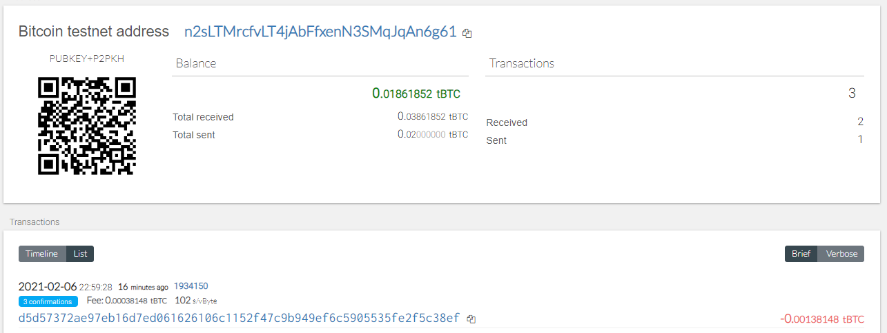

# Blockchain-Python
## BTC-Test
```Bash
 send_tx(BTCTEST, btctest_acct, "n1iadJMBs4kyQUv39uRWdA7Njw4ERnDdK9", 0.001)
```



## ETH

Unable to send, eventhough I created 10+ transaction through MyCrypto

```Bash
 send_tx(ETH, eth_acct, "0x837F5a0BC310226531458559468Cf60e8C9099fE", 1)
```


## Description
Python code to derive private key, create wallet for BTC-Test and ETH (local network), and send transactions based on specified coins.