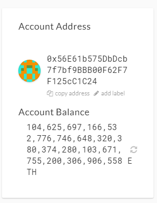

# Blockchain-Python
## BTC-Test
```Bash
 send_tx(BTCTEST, btctest_acct, "n1iadJMBs4kyQUv39uRWdA7Njw4ERnDdK9", 0.001)
```


## ETH

Unable to send, eventhough I created 10+ transaction through MyCrypto

```Bash
 send_tx(ETH, eth_acct, "0x837F5a0BC310226531458559468Cf60e8C9099fE", 1)
```




## Description
Python code to derive private key, create wallet for BTC-Test and ETH (local network), and send transactions based on specified coins.

## Installing HD-Wallet-Derive
With the latest version of PHP installed on our machines, we can now proceed to the installation of the `hd-wallet-derive` library.

### Installation

1. Begin by opening a fresh terminal. Windows users **must** open their terminal as administator as follows:

    Input `C:\Program Files\Git\bin\bash.exe` directly into the system search bar and launch the program as _Administrator_ from the resulting menu. 

2. With your terminal open as indicated for your operating system, cd into your `Blockchain-Tools folder and run the following code:

    ```shell
      git clone https://github.com/dan-da/hd-wallet-derive
      cd hd-wallet-derive
      curl https://getcomposer.org/installer -o installer.php
      php installer.php
      php composer.phar install
    ```

3. You should now have a folder called `hd-wallet-derive` containing the PHP library!